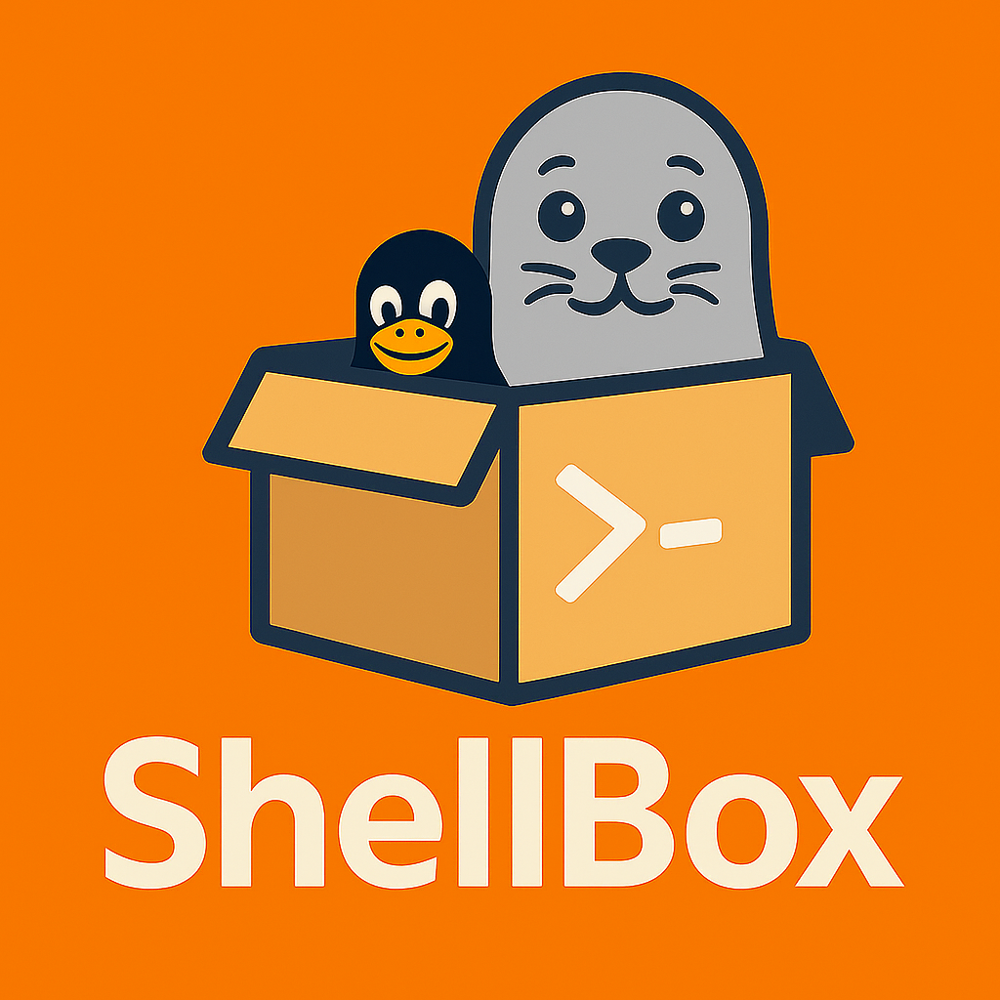

> 🌍 English version available: [README.en.md](./README.en.md)

# ShellBoxについて



「ホストを守るのは、ShellBoxじゃない。あなたです。」

ホストOS環境潔癖症の皆様に捧ぐ。

「ホストOSをいかに汚さずにコマンドを発行するか」を突き詰めたフレームワークです。

ツールというより、考え方、概念、そして精神衛生を保つための心がけ。

「人とマシンの心身を、汚さぬために。ShellBox。」

---

## 全てはコンテナで

とにかくホストOSの環境を汚したくないのです。

macOSで開発する際、HomebrewやMacPortsなどでツールをインストールすることが多いですが、過去に環境を壊してしまった経験から、現在は環境保全を最優先に考えています。

先日もazure cliをmacportsで入れようとしたら、macportsにazure cliは存在はするけどまともに動かなくて、やむなくbrewも入れる、、、という羽目になりました。portsもbrewも共存できるので問題はないのですが、やっぱり気持ち悪いのです。わかりますかねこの気持ち。

dockerやpodmanを使うと、ホストOSの環境を汚さずにコマンドを実行できるので、非常に精神衛生上よろしいです。

## ShellBoxの仕組み

ShellBoxの仕組み

ShellBoxは、特定のコマンドをコンテナ内で実行可能にするカプセル化ユニットです。

- 各コマンドごとに専用のコンテナイメージを作成
- ローカルの作業ディレクトリを /mnt にマウント
- podman run により、コンテナからホストのデータを操作

これにより、環境を汚すことなくツールを再利用・共有できます。

---

## 🧱 ENTRYPOINTをつくる、それがすべて

ShellBoxにおける唯一の原則は、「ENTRYPOINTをつくること」です。

あなたの作ったそのコマンドが、最終的に `ENTRYPOINT` に指定され、シェル操作の起点として機能するならば、
それがどんな手段で整備されたものであっても、ShellBoxは一切問いません。

Pythonスクリプト、Goバイナリ、Cの静的リンクバイナリ、Node.jsのCLIツール、Ansibleで構築された環境……  
それらはすべて「ENTRYPOINTさえ定まっていれば問題なし」です。

ShellBoxは「ワンコマンドで実行できる環境の起動装置」であり、  
その環境をどう整備するかには一切干渉しません。

---

## おすすめコンテナランタイム

podmanをおすすめします。Dockerでもよいですが、podmanのほうが好きだからです。ロゴにもpodmanのセルキーが入っている手前もありますし。

podmanのほうがrootlessで動かせるので、セキュリティ的にも安心です(今日びのDockerでもできますけどね)。とくにこの仕組のは細かいツールをたくさんコンテナ化する形になるので、変なことをしてrm -rf なんぞをしてしまっても安心。

あ、でも、Dockerで動いていたものをpodmanのrootlessで動かそうと思うと思いのほか面倒なことが多いので、覚悟してください。

---

### デフォルトのBase Imageについて

ShellBoxでは、実用性と潔癖性のバランスを考慮し、distrolessを推奨しており
`gcr.io/distroless/base-debian12:debug-nonroot` をデフォルトのベースイメージとしています。

これは `ls` や `cat` などの最低限のユーティリティを含みつつ、

- root権限なし（nonroot）
- 最小限のパッケージ
- セキュリティ高め

という特性を持ち、ShellBoxの思想にもっとも近い実行環境であると考えています。

[distrolessで利用できるイメージ一覧](https://github.com/GoogleContainerTools/distroless?tab=readme-ov-file#what-images-are-available)

---

## Dockerfileの例

### 基本コマンド（例: `ls`）

```Dockerfile
FROM gcr.io/distroless/base-debian12:debug-nonroot
ENTRYPOINT ["ls"]
```

```sh
podman build -t shellbox_ls .
podman run --rm -v "$PWD":/mnt shellbox_ls /mnt
```

### Pythonスクリプト実行例

```Dockerfile
FROM gcr.io/distroless/python3-debian12:debug-nonroot
ENTRYPOINT ["python3"]
```

```python
# test_script.py
print("Hello, ShellBox!")
```

```sh
podman build -t shellbox_python .
podman run --rm -v "$PWD":/mnt shellbox_python /mnt/test_script.py
```

---

## ShellBoxの使い方

### インストール

以下のコマンドでShellBoxをインストールします。

```sh
curl -sSL https://raw.githubusercontent.com/buraiha/shellbox/main/lib/setup.sh | bash
```

再インストールしたい場合：

```sh
curl -sSL https://raw.githubusercontent.com/buraiha/shellbox/main/lib/setup.sh | bash -s -- --force
```

### アンインストール

ShellBoxをアンインストールする場合は、以下のコマンドを実行します。

```sh
curl -sSL https://raw.githubusercontent.com/buraiha/shellbox/main/lib/teardown.sh | bash 
```

## 🧪 ShellBoxコマンドの基本機能

`shellbox` は、ShellBox環境全体を管理するためのCLIツールです。以下のような機能を提供しています。

| コマンド | 説明 | 使用例 | 備考 |
|---------|------|----------|------|
| `shellbox init` | ShellBoxの基本ディレクトリ構成を初期化します（`bin`, `log`, `containers`, `lib` などを作成） | `shellbox init` | 初回セットアップ時に実行 |
| `shellbox install <name> <entrypoint> [image] [-f | --force] [--root]` | ShellBoxコマンドをインストールします。指定された ENTRYPOINT とイメージでコマンドをShellBox化し、スクリプトを `/usr/local/shellbox/bin/<name>` に生成します | `shellbox install sb-ls ls` | `image` を省略すると `distroless` ベースになります。busybox等の場合は `--force` 必須 |
| `shellbox rebuild <name> [--force]` | 指定したShellBoxコマンドのイメージとスクリプトを再生成します | `shellbox rebuild sb-ls` | `--force` をつけると既存の実行スクリプトを強制上書き |
| `shellbox uninstall` | ShellBoxコマンドをアンインストールします | `shellbox uninstall` | コマンドに付随するDockerfileとrunスクリプト、コンテナイメージが削除されます |
| `shellbox -e <name>` | ShellBoxスクリプトを `$EDITOR` または `vi` で編集します | `shellbox -e sb-ls` | `$EDITOR` 未設定時は `vi` 使用 |
| `shellbox -l` | インストール済みのShellBoxコマンド一覧を表示します | `shellbox -l` | `/usr/local/shellbox/bin` 配下のファイル名一覧 |
| `shellbox -r <name>` | 指定したShellBoxコマンドを削除します（スクリプト+コンテナ定義） | `shellbox -r sb-ls` | `/bin` と `/containers` 両方を削除 |
| `shellbox --path` | ShellBoxが使用するディレクトリ構成を表示します | `shellbox --path` | 各種ディレクトリの絶対パス表示 |
| `shellbox --version` | ShellBoxのバージョンを表示します | `shellbox --version` | `/usr/local/shellbox/VERSION` の中身 |
| `shellbox edit-mounts <name>` | 指定したShellBoxコマンド用のマウント設定（`mounts.conf`）を編集します | `shellbox edit-mounts sb-ls` | テンプレートがあれば初回作成も自動で実施 |

---

## 🧭 /mnt = ShellBoxにおける論理的な作業ディレクトリ

ShellBoxでは、ホスト上の作業ディレクトリ（例：`$PWD`）を原則として `/mnt` にマウントします。

これは単なる技術的都合ではなく、**ShellBoxにおける「論理的な作業ディレクトリ」**という思想的な位置づけです。

- ホスト環境を一切汚さない
- 明示的なマウントにより操作対象を限定する
- `/mnt` を前提に設計することで、スクリプトの移植性が高まる

---

## 🧩 追加マウントの定義（mounts.conf）

ShellBoxでは、特定のコマンドに対して追加のマウントを行いたい場合、
`/usr/local/shellbox/containers/<コマンド名>/mounts.conf` を編集してください。

- `-v` オプション形式`ローカルDir:コンテナDir`で記述（1行につき1マウント）
- コメント行（`#`）と空行は無視されます
- 例:

```text
/home/takashi/.ssh:/root/.ssh:ro
/tmp/output:/out
```

---

## 🧰 カスタムテンプレートの考え方

ShellBoxは、`/usr/local/shellbox/bin/runsh_template.sh` をテンプレートとして使用し、各コマンドに応じたコンテナの実行スクリプト（**ShellBoxスクリプト**）を生成します。

原則として、ShellBoxスクリプトは引数 `$@` を一切加工せず、そのままコンテナの `podman run` に透過的に渡します。これにより、幅広いコマンドに対応できる汎用的な仕組みを実現しています。

ただし、以下のような「特殊な引数構造」や「入出力の制約」があるコマンドについては、必要に応じてテンプレートスクリプト（`runsh_template.sh`）あるいは、`shellbox install` によって`/usr/local/shellbox/bin`に作成されるShellBoxスクリプトをカスタマイズして対応してください。

---

### 🔸 カスタマイズが有効なケース

| コマンド例 | 特殊な事情 |
|------------|----------------|
| `jq` | 標準入力が必要。`echo ... \| jq` のような形をとるため、Podmanに `-i` オプションを付与して stdin を有効にする必要がある。 |
| `openssl req -new` | 対話的入力が発生するため、`-it` を付けて pseudo-TTY を有効にする必要がある。 |
| `convert input.png output.jpg` | 明示的にファイルを参照するため、ホスト側ファイルが `/mnt/` にあることを前提としてShellBoxスクリプトを調整する必要がある。 |

---

### 💡 標準入力（stdin）についての注意

ShellBoxスクリプトのデフォルトでは、Podmanに `-i`（標準入力を有効にする）オプションを**付けていません**。  
そのため、以下のような「標準入力を使うコマンド」は、そのままでは正しく動作しない可能性があります。

#### 例：

```sh
# ❌ デフォルトのShellBoxスクリプトでは反応しない例
echo '{"foo": 1}' | my_jq '.foo'
```

このような場合は、ShellBoxスクリプトを以下のようにカスタマイズしてください：

```sh
#!/bin/sh
CMD_IMAGE="{{CMD_IMAGE}}"

if ! podman run --rm -i -v "$PWD":/mnt "$CMD_IMAGE" "$@"; then
    echo "❌ 実行エラー: stdinを使う処理で失敗しました。" >&2
    exit 1
fi
```

TTYが必要な場合（対話的コマンド）には、`-it` に変更してください。

#### 🔧 カスタマイズ例（TTY付き）

```sh
#!/bin/sh
CMD_IMAGE="{{CMD_IMAGE}}"

if ! podman run --rm -it -v "$PWD":/mnt "$CMD_IMAGE" "$@"; then
    echo "❌ 実行エラー: TTYが必要な処理で失敗しました。" >&2
    exit 1
fi
```

---

## 📌 運用ルールの提案

- 一般的なコマンド（`ls`, `python`, `grep` など）は、そのままのShellBoxスクリプトで `$@` を透過させるだけで動作します。
- 特殊な入出力要件がある場合は、各ShellBoxスクリプトやコンテナイメージ（DockerfileやENTRYPOINT）で柔軟に対応してください。
- **ShellBox本体は引数や入出力の意味を解釈しません。コマンドごとの責任分離と再利用性を重視しています。**

- **ShellBoxは「コンテナに入って作業する」ための仕組みではありません。**
  - それをしたくなったら、それはShellBoxの出番ではなく、podman run -it や docker exec の出番です。
  - ShellBoxは「単一目的の処理ユニット」を安全に繰り返すための仕組みです。

### ❗ 問題発生時、sudoによる回避は「本末転倒」です、、、けどもね

rootlessで動いているために、様々な問題が発生する場合があります。それらは、 `sudo podman run` によって一時的に問題を回避できるように見える場合があります。  
しかし、**ShellBoxの目的は「ホストOSの保護」であり、sudoによるroot権限実行はその理念に反します。**

・・・だけど、一応、ShellBoxコマンドインストール時に--root オプションを付与して、root権限で実行させることは可能です。

例えば、let's encryptの証明書を更新する`certbot`コマンドは、sudo権限で実行する必要があります。その場合は、certbotコマンドをインストールする際に `--root` オプションを付けてください。

## 【補足】wsl での利用について

以前は動作保証が難しいため非サポート(何かしようとして、失敗して「wslはアカンな」と作者が勘違いした可脳性が高いですが、現行の WSL2環境では十分に安定して動作するため、現在は制限していません。  
ただし、特殊なマウント構成やTTY関連では制限がある可能性があります。ご自身の責任でお試しください。

## 今後盛り込みたい機能

GitHubの[issue](https://github.com/buraiha/shellbox/issues)を参照。現在の問題点と、今後の追加機能を記載。

- socatによるコンテナからホストOSへののシリアルポートプロキシ、またその他のプロキシ機能
- マルチステージビルドでstaticなカスタムバイナリをビルド -> 設置・runを簡便にする仕組み
- ★QEMUをを使った、コンテナどころじゃない、OSからして完全に隔離された実行環境の提供
  - ブランチ: [issue4_qemu](https://github.com/buraiha/shellbox/tree/issue4_qemu) で実験中

---

## 最後に

ShellBoxは、「ホスト環境を守る」というただ一点に特化した実行環境カプセルです。
開発者の精神衛生を守るために、ぜひご活用ください。

あと、なんか「こんな楽しい使い方あるよ！」とか「こんな使い方考えた！」とかあれば、ぜひプルリクください。
でも、結構厳しく上記思想に照らしてレビューします。
